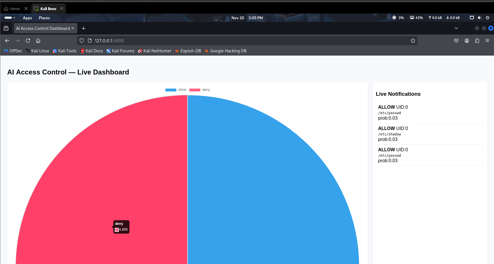

Linux OS Access Control — AI Security Layer

A real-time Linux monitoring and AI-powered access control system built using:

✔ Auditd for kernel-level monitoring

✔ Machine Learning (RandomForest) for anomaly detection

✔ Flask + Socket.IO Dashboard for live event visualization

✔ Kali Linux / Ubuntu compatibility

🖼 Dashboard Preview

Add your image here (make sure the filename matches!):

🚀 Features

🔍 Real-time file access monitoring

🤖 AI-based prediction for allow / deny events

📊 Live dashboard with:

Notifications

Action charts

Decision charts

Top accessed files

Recent events table

🛡 Works on Kali Linux, Ubuntu & Debian

⚡ Lightweight and fast (sub-second latency)

🧠 AI Model

Trained using:

UID

file depth

file extension

action type

file length

hour of day

Editable via:

quick_train.py

🛰 Run Dashboard
python3 app.py

📡 Run Audit Watcher
sudo python3 audit_watcher.py

📦 Install Dependencies
pip install -r requirements.txt

📂 Folder Structure
Linux-os-access-control/
│── app.py
│── audit_watcher.py
│── detect.py
│── quick_train.py
│── index.html
│── requirements.txt
│── screenshot.png
│── .gitignore